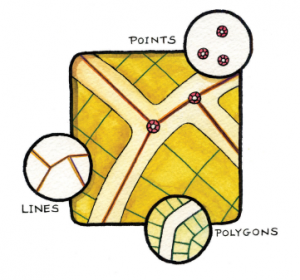

# Introducción - Obtención de datos vectoriales

Los datos vectoriales son una forma de representar características del mundo real dentro del entorno de un Sistema de Información Geográfica (SIG). Los objetos espaciales vectoriales tienen atributos, que consisten en texto o información numérica que describe los objetos espaciales. Un objeto espacial es algo que puede verse en el paisaje. 

 

## Descargar versión estable de QGIS
1. Ir a la página de descargas de QGIS. [Descargar QGIS](https://qgis.org/es/site/forusers/download.html).
2. En la sección de “Descargas de instalación”, encontrarás las opciones para diferentes sistemas operativos. Si estás usando Windows, debes hacer clic en `Descarga para Windows` o seleccionar Mac o Linux.
3. En la página de descarga, tienes dos opciones: la versión más reciente (QGIS 3.34 ‘Prizren’) y la versión más estable a largo plazo (QGIS 3.28 ‘Firenze’).  `Recomendablemente descargar la versión más estable a largo plazo`. [Versión estable](https://qgis.org/downloads/QGIS-OSGeo4W-3.28.15-1.msi).
4. Una vez que hagas clic en el enlace de descarga, se descargará un archivo de instalación en tu computadora.
5. Cuando la descarga se complete, abre el archivo de instalación y sigue las instrucciones para instalar QGIS.

Nota: Es importante mencionar que después de instalar QGIS, el primer intento de inicio puede fallar debido a las protecciones de seguridad. Para habilitar QGIS, debes hacer clic con el botón derecho sobre su icono en la carpeta Aplicaciones y seleccionar ‘Abrir’ en el menú contextual. Aparecerá un cuadro de diálogo de confirmación en el que deberás hacer clic de nuevo en el botón ‘Abrir’. Esto sólo tiene que hacerse una vez.

## Datos geoespaciales de tipo vectorial relacionados con políticas públicas

Los datos geoespaciales son un requisito previo para la buena formulación de políticas y el apoyo y seguimiento del progreso del desarrollo. La Agenda 2030 reconoce que la información geoespacial y estadística oportuna, disponible y accesible, ambas integradas con varios tipos de información adicional, son fundamentales para el seguimiento de los Objetivos de Desarrollo Sostenible. 

### Tipos de datos vectoriales
Los objetos espaciales vectoriales tienen atributos, que consisten en texto o información numérica que describe los objetos espaciales. Un objeto espacial tiene su forma representada utilizando geometría. La geometría se compone de uno o más vértices interconectados. Un vértice describe una posición en el espacio utilizando un eje X, Y y opcionalmente un eje Z.

Los datos vectoriales se caracterizan por representar características geográficas mediante puntos, líneas y polígonos. 

Cuando la geometría de un objeto espacial consiste en un solo vértice, se conoce como un elemento punto. Cuando la geometría consiste en dos o más vértices y el primer y último vértice no son iguales, se forma un elemento línea o polilínea. Cuando tres o más vértices están presentes, y el último vértice es igual al primero, se forma un elemento polígono.

1. **Puntos:** Los puntos se utilizan para representar características que se pueden ubicar con una única coordenada geográfica. Por ejemplo, podrían representar ubicaciones específicas como propiedades o ciudades.
2. **Líneas:** Las líneas, también conocidas como trayectorias, se utilizan para representar características lineales en el espacio geográfico. Por ejemplo, podrían representar carreteras o ríos.
3. **Polígonos:**  Los polígonos se utilizan para representar áreas. Estos son conjuntos de líneas que forman una forma cerrada. Por ejemplo, podrían representar áreas geográficas como montañas, masas de agua, o los límites de una ciudad.

Optical imagery (left) vs. radar imagery (right) of the Kliuchevskoi Volcano erupting. *Source: Michigan Tech Volcanology*

These advantages are very powerful, though there are always multiple sides to consider when selecting the correct type of data for your research project. Let’s examine some of the cons of radar data.

1. **Challenging interpretation.** Unlike optical imagery, which most people can intuitively interpret as it appears very similar to a photograph taken with one’s cell phone, radar imagery is not as easy to understand immediately. It contains information about energy outside of the visible light spectrum, and so it often requires more training for a user to understand what they are looking at in a radar image.
2. **Speckling.** Radar images often appear grainier than optical imagery.
3. **Topographical effects.** Topography has a greater effect on radar imagery than optical imagery, as the terrain can reflect the energy radars measure and thus distort the image. 

Given these advantages and disadvantages, let’s understand why they exist in the first place. The major driver behind these differences is the way the data is collected. 

## Data Collection
### Passive vs. Active Measurements
This concept should sound familiar, as we briefly discussed it in the Introduction to Remote Sensing lesson. It is a key difference, however, so we will discuss it far more in depth here.

Optical sensors are called passive sensors because they rely solely on energy from an outside source (e.g, the sun) to capture their measurements. This reliance on outside energy sources limits these sensors by the effects of the atmosphere. Energy that is simply reflected from the surface of the Earth cannot penetrate things such as cloud cover or fog, and thus makes it difficult to gather data consistently in areas that experience this type of weather often.

Diagram of passive remote sensing. *Source: NASA Applied Remote Sensing Training Program*

Radar is a form of active remote sensing. These sensors provide their own artificial source of energy for illumination of the Earth’s surface, which can get through clouds, vegetation, and even soil depending on the type of signal they send down. Radars measure the energy that is reflected back from its own signal to generate an image of the surface of the Earth.

Imaging radars are side-looking, which means they transmit energy at a 90 degree angle in order to differentiate between two objects on the ground. By transmitting energy at an angle, it allows energy to bounce off of objects on the ground and reach the radar at different times so that the two objects can be distinguished. 

Side-looking radar. *Source: Side looking airborne radar, Charly Whisky.* 

### What do radars measure?

**Radar components.** There are four primary parts of a radar system that allow it to collect information:
1. **Transmitter.** This device outputs short bursts of microwave energy at regularly scheduled intervals. (The “active” part of active remote sensing!)
2. **Antennae.** The antennae focuses the series of pulses from the radar into a beam that illuminates the surface at a right angle to the motion of the platform. 
3. **Receiver.** The antennae receives the energy that is reflected, or *backscattered*, from the Earth’s surface. The time at which the energy is received by the antennae allows the system to pinpoint the location of the object it reflected off of.
4. **Electronic processing system.** This system processes the backscattered signal to generate an image.

In addition to the time at which the signal is received, which is referred to as the phase (a point in time in the position of the waveform) of the signal, radars also measure the amplitude (strength) of the reflected signal. Amplitude is called the *backscatter coefficient*, or $\sigma_{0}$, and is expressed as the fraction of the energy that is backscattered to the radar per unit target area. The value is measured in decibels (dB) and can range from around -25 dB (very little energy reflected back) to 1 dB (high amount of energy reflected back.

### What is SAR?
Radars possess two types of resolution: (1) **Range (across track) resolution** defines the ability of the radar to distinguish between two targets perpendicular to the path of the sensor that are close in range. This type of resolution is determined by length of pulse sent out by the transmitter. (2) **Azimuth (along-track) resolution** defines the ability of the radar to distinguish between two objects parallel to the path of the sensor that are close together. This resolution is determined by the beam length, which is inversely proportional to the length of the antennae, or aperture. 

SAR resolution. *Source: MathWorks*

A longer antennae, then, results in a narrower beam and thus finer resolution. Sending extremely long antennas out into space, however, is highly unrealistic. Instead, scientists leveraged the Doppler shift associated with the motion of the aircraft to simulate a very long antennae. This simulation creates a “synthetic aperture.” Synthetic aperture radar, or SAR, is able to generate higher resolution images compared to the actual length of the antennae. 

### Choosing the Right Type of Radar
There are plenty of different characteristics that distinguish sensors from each other, but the three most common factors to consider are listed below. 

**Wavelength.** The length of the wave really determines how the beam will interact with the surface of the Earth, and thus what type of information you can ascertain from the image. The most significant aspect it affects is how far the beam can penetrate the surface. Longer wavelengths can penetrate through forest canopy or soil more effectively. The table below shows the different wavelength bands used, the name for each one, and some common applications. Note that the names of the wavelength bands are somewhat random and hard to follow – this is on purpose! For a long time radar data was used only by the military, so they selected names for the bands to hinder anyone from figuring out what each band represented. 

| Band | Wavelength (cm) | Application                              |
|------|-----------------|------------------------------------------|
| Ka   | 0.8 to 1.1      | high resolution data                     |
| K    | 1.1 to 1.7      |                                          |
| Ku   | 1.7 to 2.4      | glaciology, snow cover mapping           |
| X    | 2.4 to 3.8      | agriculture, ocean, high resolution data |
| C    | 3.8 to 7.5      | ocean, agriculture                       |
| S    | 7.5 to 15.0     |                                          |
| L    | 15.0 to 30.0    | agriculture, forestry, soil moisture     |
| P    | 30.0 to 100.0   | biomass, soil moisture, penetration      |

Surface penetration based on wavelength. *Source: SAR 101: An Introduction to Synthetic Aperture Radar, Daniel Hogan*

**Polarization.** Radar signals are polarized and usually denoted as **horizontal (H)**, or **vertical (V)**. These polarizations affect the way that the signal is both transmitted and received and the physical properties of an object that are detected. There are four typical polarization combinations:
* HH: horizontal transmit, horizontal receive
* VV: vertical transmit, vertical receive
* HV: horizontal transmit, vertical receive
* VH: vertical transmit, horizontal receive

**Incidence angle.** The final factor to consider is the incidence angle, &theta;, which is the angle between the direction of the radar beam and the plan perpendicular to the surface of the Earth.

Incidence angle. *Source: NASA Applied Remote Sensing Training Program*

The larger the incidence angle, the greater the sensitivity to surface roughness. These beams will be able to penetrate less deep than beams that have smaller incidence angles, and also result in lower levels of backscatter.

### Surface Effects
The factors we discussed above are all radar properties that will affect the backscatter received by the radar. There are also surface properties that have an effect on the backscatter. The combination of these effects makes an impact on the data the sensor collects, and thus the data provides information on the following two surface parameters. 

**Surface roughness.** Surface roughness is defined as the average height variations in the surface cover on the order of centimeters. This factor has the primary impact on the tones of a radar image and level of backscattering. Smooth surfaces, or surfaces where the variations in height are much smaller than the radar wavelength, appear darker in radar images while rough surfaces appear lighter. This difference is due to the type of **backscattering mechanism** that the type of surface triggers. There are four primary types of backscattering:
1. **Specular reflection.** Smooth surfaces tend to reflect all of the energy away from the radar. These areas appear very dark in radar images. Ex: open water
2. **Diffuse reflection.** Rough surfaces, where the level of roughness approaches the length of the microwave, start to reflect some of the energy back to the radar. These areas appear somewhat brighter. Ex: rocky open areas, grasslands.
3. **Double bounce reflection.** This type of reflection occurs when energy bounces off a smoother surface and then bounces again on a nearby, vertical object so that most of the energy scatters back to the radar. These areas appear very bright. Ex: urban areas, inundation
4. **Volume scattering.** This type of scattering occurs within a volume or medium. Energy bounces of a number of different elements within the medium to cause wide amounts of scattering, some of which returns to the radar. The brightness can vary, but is usually moderately bright. Ex: snowpack, forests.

Backscattering mechanisms. *Source: Advantages and Applications of Synthetic Aperture Radar as a Decision Support Tool, Molthan et al., NASA*

**Dielectric properties.** The dielectric properties of a material have a big effect on the surface’s ability to absorb or reflect microwaves – so much so that the magnitude of the backscatter is proportional to the dielectric constant of the surface. Liquid water has a much higher dielectric constant than other materials including frozen water (a dielectric constant of 80 compared to a range of 0-10), and so the presence or absence of water defines a surface’s dielectric properties. For the most part, surfaces with high dielectric constants have higher reflectivity and thus appear brighter than those with lower dielectric constants.

## Radar Instruments

| Radar System    | Band | Wavelength (cm) | Spatial Resolution (m) | Temporal Resolution (days) | Timeframe                                | Provider  |
|-----------------|------|-----------------|------------------------|----------------------------|------------------------------------------|-----------|
| BIOMASS         | P    | ~69.0           |                        | 3                          | Launch 2024                              | ESA       |
| ALOS-2 PALSAR-2 | L    | ~23.5           | 3-10                   | 14                         | 2014 - present                           | JAXA      |
| NISAR-L         | L    | ~23.5           | 3-10                   | 12                         | Launch 2024                              | NASA/ISRO |
| NISAR-S         | S    | ~9.4            | 3-10                   | 12                         | Launch 2024                              | NASA/ISRO |
| Sentinel-1      | C    | ~5.6            | 25-800                 | 6                          | 2014 - present (1A), 2016 - present (1B) | ESA       |
| Radarsat-2      | C    | ~5.6            | 3-100                  | 1                          | 2007 - present                           | CSA       |
| TerraSAR-X      | X    | ~3.1            | 1-5m                   | 11-22 days                 | 2007 - present                           | ADS/DLR   |
