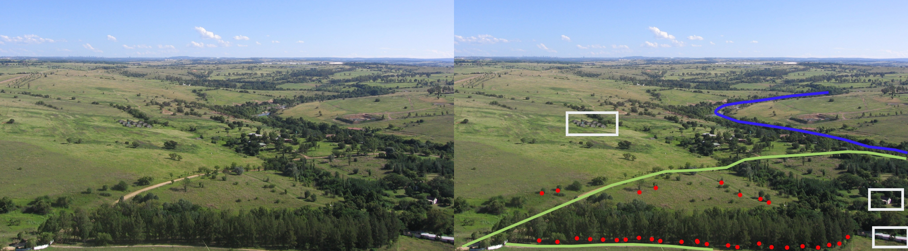

# Introducción - Obtención de datos vectoriales

Los datos vectoriales son una forma de representar características del mundo real dentro del entorno de un Sistema de Información Geográfica (SIG). Los objetos espaciales vectoriales tienen atributos, que consisten en texto o información numérica que describe los objetos espaciales. Un objeto espacial es algo que puede verse en el paisaje. 

 

## Descargar versión estable de QGIS
1. Ir a la página de descargas de QGIS. [Descargar QGIS](https://qgis.org/es/site/forusers/download.html).
2. En la sección de “Descargas de instalación”, encontrarás las opciones para diferentes sistemas operativos. Si estás usando Windows, debes hacer clic en `Descarga para Windows` o seleccionar Mac o Linux.
3. En la página de descarga, tienes dos opciones: la versión más reciente (QGIS 3.34 ‘Prizren’) y la versión más estable a largo plazo (QGIS 3.28 ‘Firenze’).  `Recomendablemente descargar la versión más estable a largo plazo`. [Versión estable](https://qgis.org/downloads/QGIS-OSGeo4W-3.28.15-1.msi).
4. Una vez que hagas clic en el enlace de descarga, se descargará un archivo de instalación en tu computadora.
5. Cuando la descarga se complete, abre el archivo de instalación y sigue las instrucciones para instalar QGIS.

Nota: Es importante mencionar que después de instalar QGIS, el primer intento de inicio puede fallar debido a las protecciones de seguridad. Para habilitar QGIS, debes hacer clic con el botón derecho sobre su icono en la carpeta Aplicaciones y seleccionar ‘Abrir’ en el menú contextual. Aparecerá un cuadro de diálogo de confirmación en el que deberás hacer clic de nuevo en el botón ‘Abrir’. Esto sólo tiene que hacerse una vez.

## Datos geoespaciales de tipo vectorial relacionados con políticas públicas

Los datos geoespaciales son un requisito previo para la buena formulación de políticas y el apoyo y seguimiento del progreso del desarrollo. La Agenda 2030 reconoce que la información geoespacial y estadística oportuna, disponible y accesible, ambas integradas con varios tipos de información adicional, son fundamentales para el seguimiento de los Objetivos de Desarrollo Sostenible. 

### Tipos de datos vectoriales
Los objetos espaciales vectoriales tienen atributos, que consisten en texto o información numérica que describe los objetos espaciales. Un objeto espacial tiene su forma representada utilizando geometría. La geometría se compone de uno o más vértices interconectados. Un vértice describe una posición en el espacio utilizando un eje X, Y y opcionalmente un eje Z.

Los datos vectoriales se caracterizan por representar características geográficas mediante puntos, líneas y polígonos. 

Cuando la geometría de un objeto espacial consiste en un solo vértice, se conoce como un elemento punto. Cuando la geometría consiste en dos o más vértices y el primer y último vértice no son iguales, se forma un elemento línea o polilínea. Cuando tres o más vértices están presentes, y el último vértice es igual al primero, se forma un elemento polígono.

1. **Puntos:** Los puntos se utilizan para representar características que se pueden ubicar con una única coordenada geográfica. Por ejemplo, podrían representar ubicaciones específicas como propiedades o ciudades.
2. **Líneas:** Las líneas, también conocidas como trayectorias, se utilizan para representar características lineales en el espacio geográfico. Por ejemplo, podrían representar carreteras o ríos.
3. **Polígonos:**  Los polígonos se utilizan para representar áreas. Estos son conjuntos de líneas que forman una forma cerrada. Por ejemplo, podrían representar áreas geográficas como montañas, masas de agua, o los límites de una ciudad.

## Recopilación de información vectorial

Para recopilar información vectorial geoespacial, es posible utilizar varias herramientas y recursos. Algunos ejemplos:

1. **MyGeodata Cloud:** Esta es una interfaz en línea donde puedes explorar datos de otros usuarios, cargar tus propios datos, administrarlos o mostrarlos en un mapa.
2. **QGIS:** Con QGIS, puedes abrir mapas digitales en la computadora, crear nueva información espacial y realizar análisis espacial.
3. **R:** Hoy en día, R cuenta con un conjunto de librerías diseñadas exclusivamente para trabajar con datos geoespaciales.
4. **Google Earth Engine:**  Contiene colecciones de datos cargadas por instituciones oficiales y datos de otros usuarios de manera colaborativa.
5. **Open Street Map:**  Contiene colecciones de datos de superficie urbana de manera colaborativa.
6. **SEDAC:**  Centro de datos de la NASA que provee datos socioeconómicos georreferenciados.
7. **AIDDATA:** Extraer datos de límites administrativos.
8. **MapBiomas:**Información registrada de vectores de referencia nacional países de América del Sur

The Global Administrative Unit Layers (GAUL). *Source: United Nations & FAO, GEE.* 

### Características, Límitaciones y Ventajas

Los datos geoespaciales vectoriales suelen estar disponibles en varios formatos, incluyendo GeoJSON, shapefiles, MapInfo, GML, geodatabase, KML y otros formatos compatibles con la biblioteca GDAL2. Estos datos se pueden descargar y luego importar a las herramientas mencionadas anteriormente para su análisis y visualización.

### Formatos más utilizados

| Formato| Ventajas | Limitaciones                              |
|------|-----------------|------------------------------------------|
| Ka   | 0.8 to 1.1      | high resolution data                     |
| K    | 1.1 to 1.7      |                                          |
| Ku   | 1.7 to 2.4      | glaciology, snow cover mapping           |
| X    | 2.4 to 3.8      | agriculture, ocean, high resolution data |
| C    | 3.8 to 7.5      | ocean, agriculture                       |
| S    | 7.5 to 15.0     |                                          |
| L    | 15.0 to 30.0    | agriculture, forestry, soil moisture     |
| P    | 30.0 to 100.0   | biomass, soil moisture, penetration      |

Surface penetration based on wavelength. *Source: SAR 101: An Introduction to Synthetic Aperture Radar, Daniel Hogan*

**Polarization.** Radar signals are polarized and usually denoted as **horizontal (H)**, or **vertical (V)**. These polarizations affect the way that the signal is both transmitted and received and the physical properties of an object that are detected. There are four typical polarization combinations:
* HH: horizontal transmit, horizontal receive
* VV: vertical transmit, vertical receive
* HV: horizontal transmit, vertical receive
* VH: vertical transmit, horizontal receive

**Incidence angle.** The final factor to consider is the incidence angle, &theta;, which is the angle between the direction of the radar beam and the plan perpendicular to the surface of the Earth.

Incidence angle. *Source: NASA Applied Remote Sensing Training Program*

The larger the incidence angle, the greater the sensitivity to surface roughness. These beams will be able to penetrate less deep than beams that have smaller incidence angles, and also result in lower levels of backscatter.

### Surface Effects
The factors we discussed above are all radar properties that will affect the backscatter received by the radar. There are also surface properties that have an effect on the backscatter. The combination of these effects makes an impact on the data the sensor collects, and thus the data provides information on the following two surface parameters. 

**Surface roughness.** Surface roughness is defined as the average height variations in the surface cover on the order of centimeters. This factor has the primary impact on the tones of a radar image and level of backscattering. Smooth surfaces, or surfaces where the variations in height are much smaller than the radar wavelength, appear darker in radar images while rough surfaces appear lighter. This difference is due to the type of **backscattering mechanism** that the type of surface triggers. There are four primary types of backscattering:
1. **Specular reflection.** Smooth surfaces tend to reflect all of the energy away from the radar. These areas appear very dark in radar images. Ex: open water
2. **Diffuse reflection.** Rough surfaces, where the level of roughness approaches the length of the microwave, start to reflect some of the energy back to the radar. These areas appear somewhat brighter. Ex: rocky open areas, grasslands.
3. **Double bounce reflection.** This type of reflection occurs when energy bounces off a smoother surface and then bounces again on a nearby, vertical object so that most of the energy scatters back to the radar. These areas appear very bright. Ex: urban areas, inundation
4. **Volume scattering.** This type of scattering occurs within a volume or medium. Energy bounces of a number of different elements within the medium to cause wide amounts of scattering, some of which returns to the radar. The brightness can vary, but is usually moderately bright. Ex: snowpack, forests.

Backscattering mechanisms. *Source: Advantages and Applications of Synthetic Aperture Radar as a Decision Support Tool, Molthan et al., NASA*

**Dielectric properties.** The dielectric properties of a material have a big effect on the surface’s ability to absorb or reflect microwaves – so much so that the magnitude of the backscatter is proportional to the dielectric constant of the surface. Liquid water has a much higher dielectric constant than other materials including frozen water (a dielectric constant of 80 compared to a range of 0-10), and so the presence or absence of water defines a surface’s dielectric properties. For the most part, surfaces with high dielectric constants have higher reflectivity and thus appear brighter than those with lower dielectric constants.

## Radar Instruments

| Radar System    | Band | Wavelength (cm) | Spatial Resolution (m) | Temporal Resolution (days) | Timeframe                                | Provider  |
|-----------------|------|-----------------|------------------------|----------------------------|------------------------------------------|-----------|
| BIOMASS         | P    | ~69.0           |                        | 3                          | Launch 2024                              | ESA       |
| ALOS-2 PALSAR-2 | L    | ~23.5           | 3-10                   | 14                         | 2014 - present                           | JAXA      |
| NISAR-L         | L    | ~23.5           | 3-10                   | 12                         | Launch 2024                              | NASA/ISRO |
| NISAR-S         | S    | ~9.4            | 3-10                   | 12                         | Launch 2024                              | NASA/ISRO |
| Sentinel-1      | C    | ~5.6            | 25-800                 | 6                          | 2014 - present (1A), 2016 - present (1B) | ESA       |
| Radarsat-2      | C    | ~5.6            | 3-100                  | 1                          | 2007 - present                           | CSA       |
| TerraSAR-X      | X    | ~3.1            | 1-5m                   | 11-22 days                 | 2007 - present                           | ADS/DLR   |
