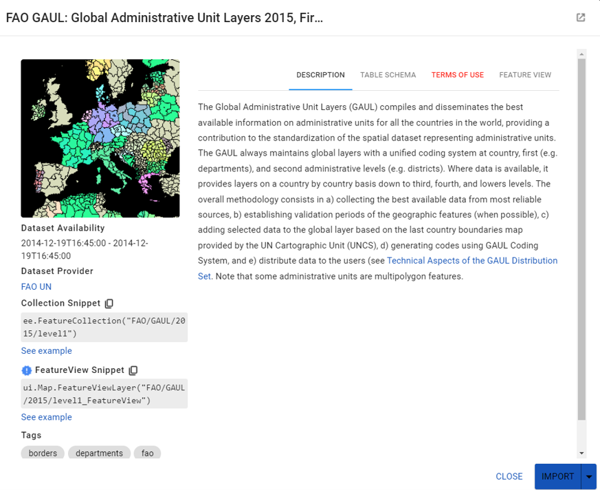

# Obtención de datos matriciales (ráster)
Los datos matriciales, también conocidos como datos ráster, son uno de los dos tipos principales de datos geoespaciales, siendo el otro los datos vectoriales.

Los datos ráster son una forma de representar información geoespacial en un formato de cuadrícula. Cada celda en la cuadrícula representa un área específica en la superficie de la Tierra y contiene un valor que representa alguna característica de ese área. Los datos ráster son especialmente útiles para representar fenómenos continuos, como la elevación del terreno, la temperatura, la precipitación, etc.

#### Características
1. Estructura de cuadrícula: Los datos ráster se organizan en una estructura de cuadrícula donde cada celda o píxel contiene un valor.
2. Representación de datos continuos: Los datos ráster son ideales para representar datos continuos como la elevación del terreno, la temperatura, etc.
3. Resolución: La resolución de los datos ráster se refiere al tamaño de cada celda en la cuadrícula. Una resolución más alta significa que cada celda representa una menor área en la superficie de la Tierra, lo que resulta en un mayor nivel de detalle.
4. Valores de celda: Cada celda en un ráster puede contener un valor que representa alguna característica de esa área en la superficie de la Tierra.

## Interés para el control público
La importancia de los datos ráster en los Sistemas de Información Geográfica (GIS) radica en su capacidad para representar datos geoespaciales de manera detallada y precisa. Los datos ráster permiten a los usuarios visualizar y analizar patrones geoespaciales y relaciones en los datos. Esto es especialmente útil en aplicaciones como la modelización del terreno, el análisis de la cobertura del suelo, la modelización del clima, entre otros. 

### Disponibilidad y métodos de acceso 
La disponibilidad de imágenes de satélite es amplia y accesible gracias a varias plataformas y proveedores.Estas plataformas ofrecen una variedad de métodos de acceso a las imágenes de satélite, incluyendo la búsqueda por zona, fecha y porcentaje de nubosidad, así como la descarga de imágenes individuales o en bloque. Es importante tener en cuenta que, aunque muchas de estas imágenes son gratuitas, algunas pueden requerir pago o suscripción para acceder a ellas.

1. **USGS EarthExplorer:** Esta plataforma ofrece una enorme colección de datos satelitales gratuitos. La selección de imágenes satelitales en EarthExplorer es abrumadora, desde datos ópticos y de radar hasta imágenes de satélites meteorológicos y mapas digitales de elevación. Para descargar grandes cantidades de imágenes satelitales gratuitas de la Tierra obtenidas por satélites del USGS, tendrás que instalar la aplicación Bulk Download.
2. **OSDA LandViewer:** Esta plataforma permite buscar, procesar y obtener información valiosa de los datos de satélite para abordar problemas comerciales reales. Con EOSDA LandViewer, ahora es más fácil que nunca encontrar y descargar la imagen satelital en vivo que necesitas, buscar combinaciones de bandas o cualquier imagen satelital actualizada o histórica.
3. **Google Earth Engine:**  Combina más de 40 años de imágenes de satélite del planeta, tanto históricas como actuales, junto con las herramientas y la potencia computacional necesarias para analizar y extraer información de este enorme almacén. La disponibilidad de imágenes de satélite en Google Earth Engine es amplia, ya que combina un catálogo multi-petabyte de imágenes de satélite y conjuntos de datos geoespaciales con capacidades de análisis a escala planetaria. El archivo de datos públicos incluye más de treinta años de imágenes históricas y conjuntos de datos científicos, actualizados y ampliados diariamente. En cuanto a los métodos de acceso, Google Earth Engine ofrece una API disponible en Python y JavaScript, lo que facilita el aprovechamiento del poder de la nube de Google para tu propio análisis geoespacial. Además, cuenta con un editor de código basado en la web para un desarrollo rápido e interactivo de algoritmos con acceso instantáneo a petabytes de datos

## Recopilación de información vectorial

Para recopilar información vectorial geoespacial, es posible utilizar varias herramientas y recursos. Algunos ejemplos:

1. **MyGeodata Cloud:** Esta es una interfaz en línea donde puedes explorar datos de otros usuarios, cargar tus propios datos, administrarlos o mostrarlos en un mapa.
2. **QGIS:** Con QGIS, puedes abrir mapas digitales en la computadora, crear nueva información espacial y realizar análisis espacial.
3. **R:** Hoy en día, R cuenta con un conjunto de librerías diseñadas exclusivamente para trabajar con datos geoespaciales.
4. **Google Earth Engine:**  Contiene colecciones de datos cargadas por instituciones oficiales y datos de otros usuarios de manera colaborativa.
5. **Open Street Map:**  Contiene colecciones de datos de superficie urbana de manera colaborativa.
6. **SEDAC:**  Centro de datos de la NASA que provee datos socioeconómicos georreferenciados.
7. **AIDDATA:** Extraer datos de límites administrativos.
8. **MapBiomas:**Información registrada de vectores de referencia nacional países de América del Sur

The Global Administrative Unit Layers (GAUL). *Source: United Nations & FAO, GEE.* 

### Características, Limitaciones y Ventajas de los formatos de datos vectoriales

Los datos geoespaciales vectoriales suelen estar disponibles en varios formatos, incluyendo GeoJSON, shapefiles, MapInfo, GML, geodatabase, KML y otros formatos compatibles con la biblioteca GDAL2. Estos datos se pueden descargar y luego importar a las herramientas mencionadas anteriormente para su análisis y visualización.

### Formatos más utilizados

| Formato| Ventajas | Limitaciones                              |
|------|-----------------|------------------------------------------|
| CSV: Los archivos CSV son archivos de texto plano donde las comas se utilizan para delimitar los datos. Son ampliamente utilizados en diversas industrias para intercambiar datos debido a su formato simple y estandarizado.   | Son eficientes para almacenar y transferir datos entre diferentes aplicaciones. Son fáciles de leer y procesar por la mayoría de las aplicaciones de software      | No tienen soporte nativo para almacenar información espacial. Para almacenar datos espaciales, generalmente se utilizan en combinación con otros formatos o estándares, como WKT (Well-Known Text) para representar geometrías.                     |
| KML: (Keyhole Markup Language) es un formato basado en XML utilizado para mostrar datos geográficos en navegadores terrestres como Google Earth. Permite a los usuarios crear y compartir información geoespacial, incluyendo puntos, líneas, imágenes, polígonos y modelos 3D    | A diferencia de un shapefile, un archivo KML puede definir simbología, etiquetado y transparencia. También es capaz de agregar superposiciones de iconos y gráficos      |  No tiene una tabla de atributos asociada y no puede producir una salida dinámica por sí solo, ya que es un lenguaje estático                                        |
| GeoJSON: Es un formato para codificar estructuras de datos geoespaciales utilizando JavaScript Object Notation (JSON). Es ampliamente utilizado en la comunidad geoespacial y se considera el estándar para representar e intercambiar datos geoespaciales en la web  | Soporta varios tipos de geometrías, como puntos, líneas y polígonos, y puede incluir propiedades y atributos adicionales para cada característica. Es compatible con herramientas populares de análisis de datos, como GeoPandas de Python o el paquete sf de R   | Al igual que KML, GeoJSON es un formato estático y no puede producir una salida dinámica por sí solo           |
| Zipped Shapefile: Los shapefiles son un formato de almacenamiento de datos vectoriales geoespaciales. Cada shapefile representa un solo tipo de geometría: puntos, líneas o polígonos   | Son rápidos de dibujar y editar. Los shapefiles manejan características individuales que se superponen o que son no contiguas. Requieren menos espacio en disco y son más fáciles de leer y escribir      | No pueden almacenar valores nulos, ni anotaciones o características de red. Los nombres de los campos dentro de la tabla de atributos están limitados a diez caracteres |
| HTML: Es un lenguaje de marcado que se utiliza para crear la estructura de una página web. Es ampliamente utilizado y soportado por todos los navegadores | Es fácil de usar, aprender e implementar. No se requiere software especial. Contiene potentes facilidades de formato de texto  | No puede producir una salida dinámica por sí solo, ya que es un lenguaje estático. Hacer la estructura de los documentos HTML puede ser difícil de entender 
